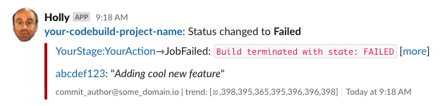
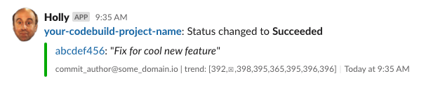

# Holly: An AWS → Slack messaging lambda

 
_[He's dead, Dave. Everybody is dead. Everybody is dead, Dave.](https://www.youtube.com/watch?v=nyKF2qd0-iQ&t=3m05s)_ 

### TODO:

:warning: This is very much a WIP, and has stalled while my team focus their efforts away from codepipleine 
for a while.  However, it does work just fine for Codepipeline + Codebuild CI setups.

I would still like to (or have a volunteer!) for:

- Complete the woefully inadequate unit testing
- Add an install guide (or even better, have install automation via something like terraform)

### What does it do?

The idea of this [AWS Lambda](https://aws.amazon.com/lambda/) is to consume arbitrary events from 
AWS services and send _useful_ slack messages based on the content and determined importance of those events.  

While there are simpler aws->slack notification solutions out there, I wanted something that would provide
all the relevant info (or at least links to it) directly in the slack notification itself.  

Right now, the lambda currently only understands Codepipeline events.  When it receives one, it will: 
 
* Query CodePipeline for execution info and run history
* Query Github for commit and author information
* Format and send all the information it could find about the events to the configured channel
* If deemed to be 'important', i.e. a pipeline state change (OK→Failed or Failed→OK), post the message 
    into an additional channel (so you don't spam your team channel with normal success information)

### Examples

 
 
  

### Ideas for further enhancement:

* Add ability to map commit authors to slack handles and directly @ the culprit for failed builds
* Add ability consume other message AWS event types / sources

### Holly? 

From [Wikipedia](https://en.wikipedia.org/wiki/Holly_(Red_Dwarf)):

> Holly is the ship's Tenth Generation AI hologrammatic computer. After releasing Dave Lister from stasis in The End, Holly told him that the crew have been wiped out by a radiation leak and that he had spent three million years in stasis. Holly prides himself on the fact he had an IQ of 6,000,[4] but after three million years by himself, he had become computer senile, or as Holly put it, "a bit peculiar". The crew often ridicule Holly on his senility, but Holly often comes out on top.

